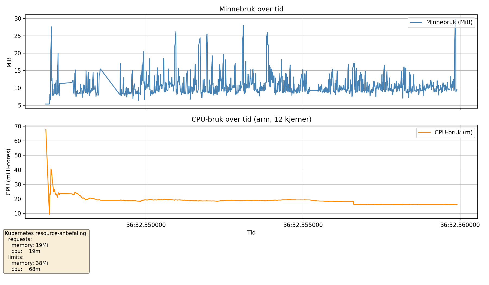

# Reposnusern

**Reposnusern** er et verktøy for å analysere GitHub-repositorier i en organisasjon – med nysgjerrighet, struktur og en dæsj AI.

## Ambisjon

Målet med dette prosjektet er å lage et fleksibelt og utvidbart analyseverktøy for utviklingsmiljøer som ønsker innsikt i kodebasen sin. Prosjektet utvikles stegvis:

### Datainnhenting

- Henter metadata, språkbruk, Dockerfiles og dependency-filer fra alle repoer i en GitHub-organisasjon.
- Data lagres i en relasjonsdatabase (PostgreSQL).
- Kjøres periodisk (f.eks. via cron-jobb).

### Teknologier og oppsett

- Språk: Go
- Database: PostgreSQL (sqlc brukt for typesikker tilgang)
- Strukturelt monorepo – men med tydelig inndeling

## PoC-status

Proof-of-Concept bruker følgende:
- `go + sqlc + PostgreSQL` 
- GitHub-API med mellomlagring i JSON
- Støtte for:
  - Repo-metadata og språk
  - Dockerfiles og dependency-filer
  - CI-konfigurasjon, README og sikkerhetsfunksjoner
  - SBOM

Dette gir et godt grunnlag for å bygge videre analyser, inkludert rammeverksdeteksjon basert på språk og filstruktur.


## 📁 Prosjektstruktur
```
reposnusern/
├── .github/workflows/         # CI-workflows (GitHub Actions)
│   └── ci.yml
│
├── cmd/                       # Entry points 
│   └── full/                  # Kjører fetch + db-import
│
├── covdata/                   # Coverage-data (nytt med Go 1.20+)
├── cover.out                  # Flat profil for dekning
├── cover.filtered.out         # Renset versjon av dekning
├── cover.html                 # Visuell visning av dekning
│
├── db/
│   ├── queries/               # sqlc-spørringer
│   └── schema.sql             # Manuell migrering (foreløpig)
│
├── internal/
│   ├── config/                # App-konfig og validering
│   ├── dbwriter/              # DB-import og analyse av filer
│   ├── fetcher/               # GitHub API-klient (REST + GraphQL)
│   ├── mocks/                 # Mockery-genererte mocks
│   ├── models/                # Delte datastrukturer
│   ├── parser/                # Dockerfile-parser og lignende
│   ├── runner/                # Orkestrering av app-flyt
│   └── storage/               # sqlc-wrapper for DB-kall
│
├── test/                      # Integrasjonstester (testcontainers)
│   └── testutils/             # PostgreSQL-testcontainer og verktøy
│
├── utils/                     # Evt. fremtidige hjelpepakker
│
├── .golangci.yml              # Konfig for statisk analyse
├── .mockery.yaml              # Konfig for mock-generering
├── sqlc.yaml                  # sqlc-konfig for generering av Go-kode fra SQL
│
├── Dockerfile                 # To-trinns containerbuild
├── go.mod / go.sum            # Moduldefinisjoner og avhengigheter
├── Makefile                   # Utviklerkommandoer og CI-mål
└── README.md

```

## Kjøring

For å hente data fra GitHub må du angi organisasjonsnavn og et gyldig GitHub-token som miljøvariabler:

```
# Bygg containeren
podman build -t reposnusnern .

# Kjør med nødvendige miljøvariabler og bind-mount for å se utdata
podman run --rm \
  -e ORG=dinorg \
  -e GITHUB_TOKEN=ghp_dintokenher \
  -e POSTGRES_DSN="postgres://<bruker>:<passord>@<fqdn>:5432/reposnusern?sslmode=require" \
  -e REPOSNUSERDEBUG=true \
  -e REPOSNUSERARCHIVE=false \
  -v "$PWD/data":/data \
  reposnusnern

```

REPOSNUSERDEBUG=true gjør at maks 10 repos blir hentet, for å teste ut uten å spamme github apiet.
REPOSNUSERARCHIVE=true vil sette at arkiverte repos også blir hentet, ellers blir kun aktive hentet.

Merk: GitHub har en grense på 5000 API-kall per time for autentiserte brukere. Koden håndterer dette automatisk ved å pause og fortsette når grensen er nådd.

## Testing

Prosjektet har støtte for både enhetstester og integrasjonstester:

### Enhetstester

* Skrevet med [Ginkgo](https://onsi.github.io/ginkgo/) og [Gomega](https://onsi.github.io/gomega/) for BDD-stil
* Bruker `mockery` for generering av mocks
* Testbare komponenter bruker interfaces og dependency injection der det gir mening

Kjør enhetstester:

```bash
make unit
```

### Integrasjonstester

* Ligger i `test/`-mappen
* Kjøres mot en ekte PostgreSQL-database i container via [testcontainers-go](https://github.com/testcontainers/testcontainers-go)
* Initialiseres med `schema.sql`

Kjør integrasjonstester:

```bash
make integration
```

> Merk: Du må ha støtte for Podman eller Docker for å kjøre integrasjonstestene.

### Samlet testkjøring og linting

```bash
make test     # Kjører både unit og integration (hvis mulig)
make ci       # Kjører hygiene + test: tidy, vet, lint, test
```

## Inspirasjon
 - [Fuck it, ship it - Stine Mølgaard og Jacob Bøtter](https://fuckitshipit.dk/)
 - [Codin' Dirty - Carson Gross](https://htmx.org/essays/codin-dirty/)
 - 差不多 (chà bù duō) - «godt nok» altså at noe ikke er perfekt, men tilstrekkelig.

## Benchmark
Med ca 1600 repos:



## Erklæring om bruk av generativ KI

Under utviklingen av dette innholdet har forfatter(e) benyttet generativ KI – inkludert M365 Copilot og ChatGPT – til å omformulere og effektivisere tekst og kode. Alt innhold er deretter gjennomgått og en del redigert manuelt. 

## TODO

- [ ] Bedre logging
- [ ] Sørge for at GraphQL versjonen også parser lenger ned enn toppnivå mappen.
- [ ] Optimalisering
  - [ ] Lage en bulk insert til db for relevante objekter
  - [x] Fortsette å optimalisere på minne
- [ ] Oppdatere schema så vi tar vare på dato vi har hentet informasjonen fra. (Så vi kan ta vare på trenden.)

- [x] Refaktorere til ideomatisk go
- [x] Parsing av forskjellige dependency filer
- [x] Også hente REST API endpoints for software bill of materials (SBOM)
- [x] Hindre at passord og secrets utilsiktet havner i logger
- [x] Legge til noen enkle tester
- [x] Refaktorering og deling av logikk
- [x] Gjøre om alle testene til Ginko/gomega
- [x] Gjøre klart for K8s-deploy (config, secrets, jobs)
- [x] Vurdere om sbom direkte har fjernet behovet for dependency files
- [x] Forbedre dockerfile features parseren for mer info
